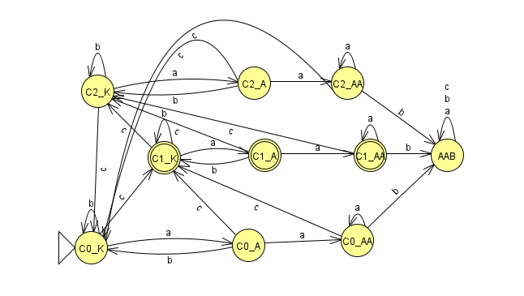

# 1. Házi

## Feladat

## `|w|_c = 1 mod 3`

### Állapot átmenet

| Állapot | a | b | c |
|---------|---|---|---|
| <ins>C_0</ins> | C_0 | C_0 | C_1 |
| **C_1** | C_1 | C_1 | C_2 |
| C_2 | C_2 | C_2 | C_0 |

 

## Nem szerep `aab` résszóként

### Állapot átmenet

| Állapot | a | b | c |
|---------|---|---|---|
| <ins>**Kezdő**</ins> | A | Kezdő | Kezdő |
| **A** | AA | Kezdő | Kezdő |
| **AA** | AA | AAB | Kezdő |
| AAB | AAB | AAB | AAB |

 

## Kettő állapotgép metszete

| Állapot | a | b | c |
|---------|---|---|---|
| <ins>(Kezdő, C_0)</ins> | (A, C_0) | (Kezdő, C_0) | (Kezdő, C_1) |
| **(Kezdő, C_1)** | (A, C_1) | (Kezdő, C_1) | (Kezdő, C_2) |
| (Kezdő, C_2) | (A, C_2) | (Kezdő, C_2) | (Kezdő, C_0) |
| (A, C_0) | (AA, C_0) | (Kezdő, C_0) | (Kezdő, C_1) |
| (AA, C_0) | (AA, C_0) | (AAB, _) | (Kezdő, C_1) |
| **(A, C_1)** | (AA, C_1) | (Kezdő, C_1) | (Kezdő, C_2) |
| **(AA, C_1)** | (AA, C_1) | (AAB, _) | (Kezdő, C_2) |
| (A, C_2) | (AA, C_2) | (Kezdő, C_2) | (Kezdő, C_0) |
| (AA, C_2) | (AA, C_2) | (AAB, _) | (Kezdő, C_0) |
| (AAB, _) | (AAB, _) | (AAB, _) | (AAB, _) |

> Egyszerűsítés végett `(AAB, C_0)`, `(AAB, C_1)` és `(AAB, C_2)` állapotokat nem ábrázoltam, hanem `(AAB, _)`-vel helyettesítettem.