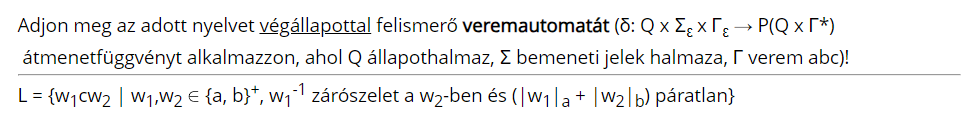
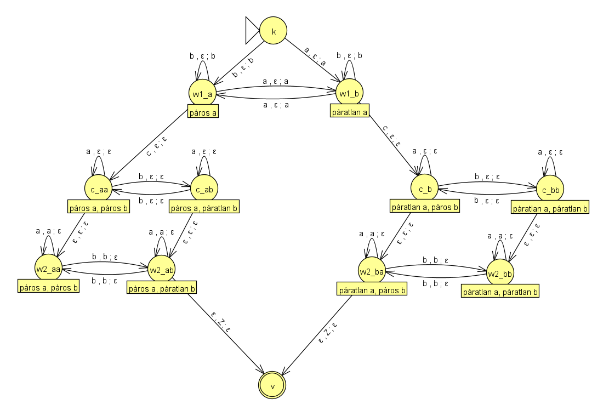

# 2. Házi

## Feladat  

## Elvárás

Végállapottal felismerő veremautomata

## Megoldás

### `w_1` és `w_2` szavak felismerése

Mivel a `c` karakter kötelezően egyszer szerepelhet a szóban (kizárva ezzel az üresszót), így ennek felismerése jelöli a határt a w_1 és w_2 (rész)szavak között.

Az is fontos, hogy ezek a szavak pozitív iteráltak, így üres szó nem lehet egyik sem.

### `(|w_1|_a + |w_2|_b) % 2 == 1` probléma

Ez a rész probléma az állapotok megoldásával könnyen kezelhető. 

A megoldás menete az, hogy az első szónál (`w_1`) vizsgáljuk, hogy páros vagy páratlan az `a`-k száma, és ez alapján amikor áttérünk a `w_2`-re, akkor tudjuk, hogy ott páros vagy páratlan `b`-nek kell szerepelnie (páros esetén páratlan, páratlan esetén páros).

Az első bemenettől kezdve számoljuk az `a`-k számát, az első `c` karakterig, így megkapjuk a `|w_1|_a` értéket.

Az első `c` karakter után rögtön elkezdjük a `b`-k számolását, így megkapjuk a `|w_2|_b` értéket. Fontos, hogy ezt akkor is végezni kell, amikor még a zárószelet számítás még **nem** kezdődött meg (lásd következő alcím).

### `w_1` zárószelete `w_2`-nek probléma

Ha egyezést keresnénk, akkor elég lenne az, hogy amíg `w_1` állapotban vagyunk, addig minden beolvasott betűt a veremre rakunk, majd `w_2`-ben azokat levesszük róla, és ha ez üres vermet eredményez a szó végére, akkor elfogadjuk a bemenetet, viszont ez nem működik zárószelet keresésnél, pontosabban ezt ki kell bővíteni.

A zárószelet keresést úgy kell bővíteni, hogy `w_2` lehet tetszőlegesen hosszabb, így nem determinizmussal minden c után beolvasott karakternél van egy esély, hogy ez tényleg a zárószelet, így elindítunk egy futtatást, ami ezt ellenőrzi, továbbá marad egy futtatás, ami ezt a betűt nem veszi figyelembe (Fontos, hogy ettől még a `b` karaktert szmáolni kell!).

### Állapot átmenet diagram

Állapot adatkódolás:

- Első alávonás előtti rész: melyik részén járunk bemenetnek. 
    - `w1` - az első szót
    - `w2` - a második szót
    - `c` - az átmenet jelet

- Első alávonás utáni rész: Az egyes részszavak (`w1` és `w2`) párossága kódolva.
    - `a` - páros a
    - `b` - páratlan a
    - `aa` - páros a, páros b
    - `ab` - páros a, páratlan b
    - `ba` - páratlan a, páros b
    - `bb` - páratlan a, páratlan b